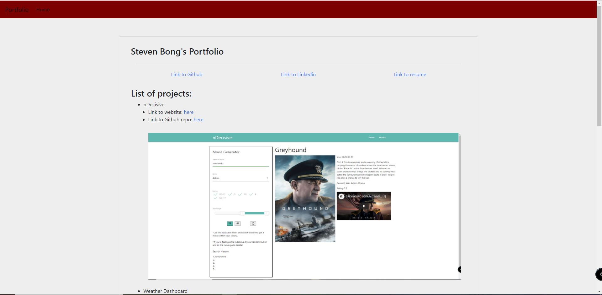

# Portfolio Generator

## Description 
The purpose of this repository is to generate a portfolio page to show case individual ability from their contributions in making challenges and project that they have done so far. This page can be used to promote individual when they jump into the real world where they not only show their resume or github or linkedin, but they also need to show their ability by making this portfolio. This portfolio consists of several section from the introduction, marketing, and contact information if the employer decided to contact this individual if they are interested after seeing this portfolio

## Table of Contents
* [Installation](#installation)
* [Usage](#usage)
* [Credits](#credits)
* [License](#license)

## Installation 
To make this portfolio, I have used Materialize CSS Framework, HTML/CSS file, and JavaScript file to make it responsive.

## Usage 
The usage of this application mainly is to promote and showcase yourself using your ability that you have learned and implement it to this portfolio to attract the employer when they visit this portfolio
<!--  -->
  
## Contributions
 

Language Contributions

To use the badges, feel free to check [shields.io](https://shields.io/) website for variety of badges

## License 
  
MIT License

## Application Screenshot

